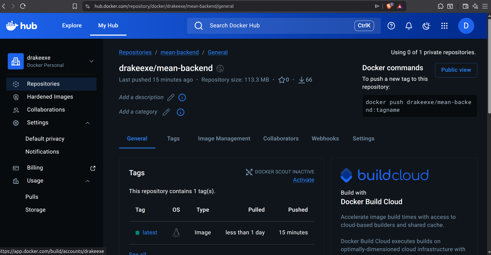
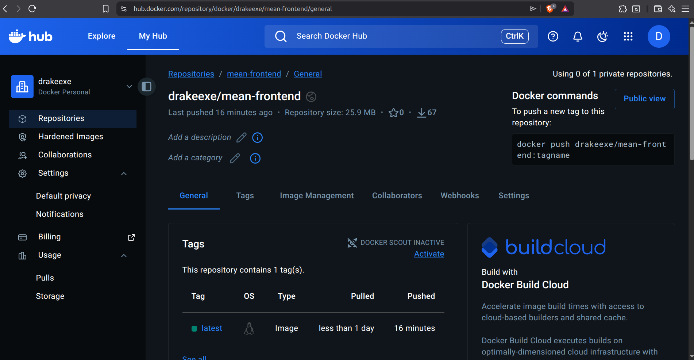
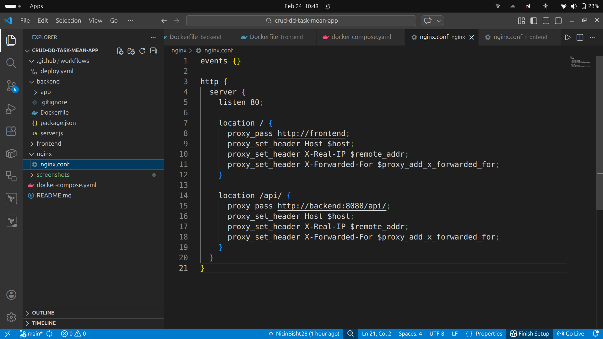
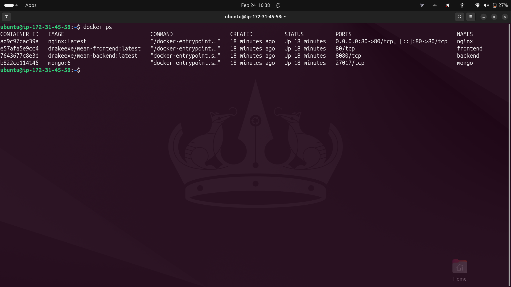
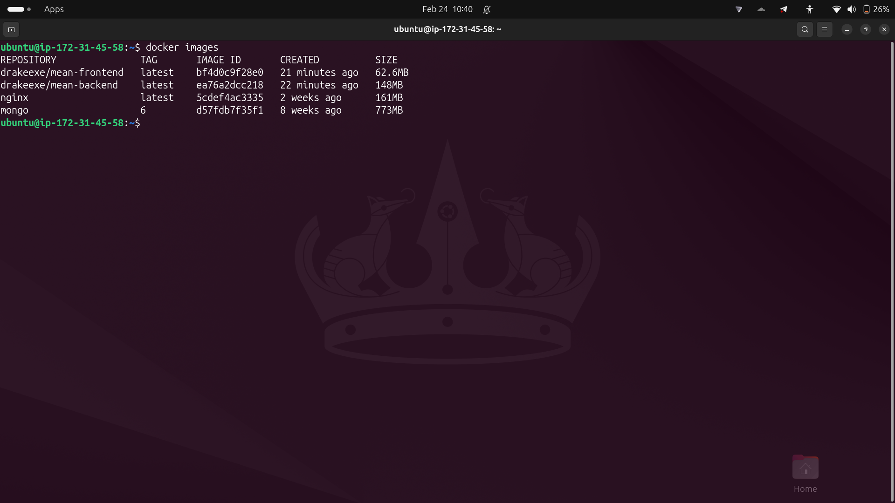
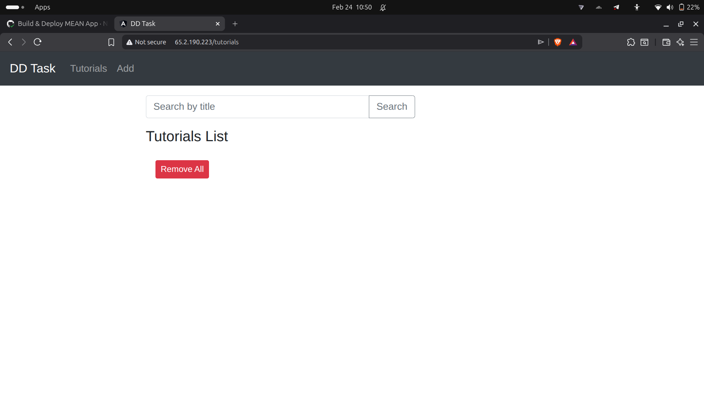
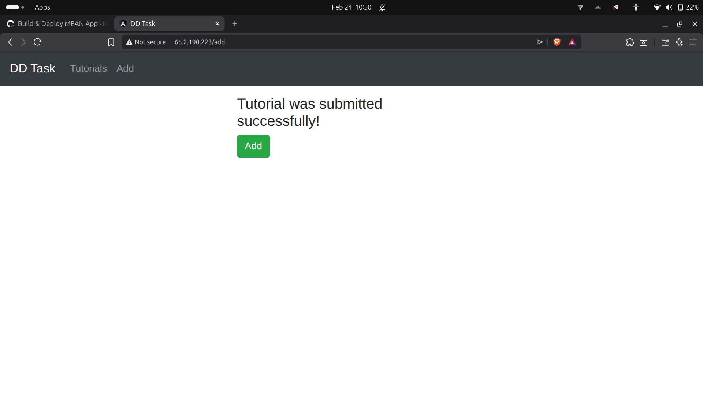
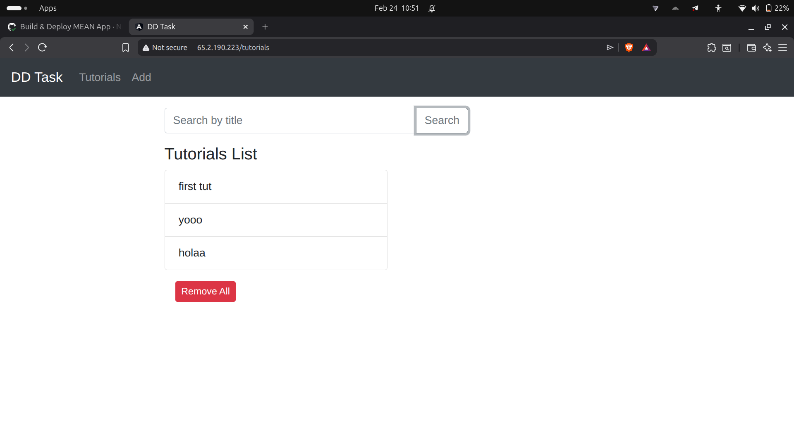
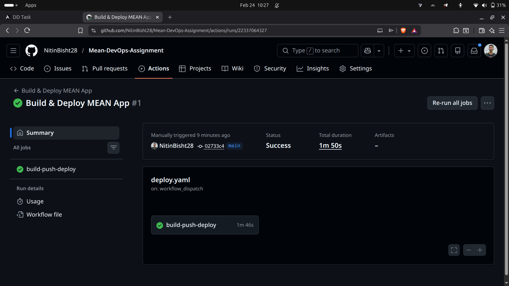
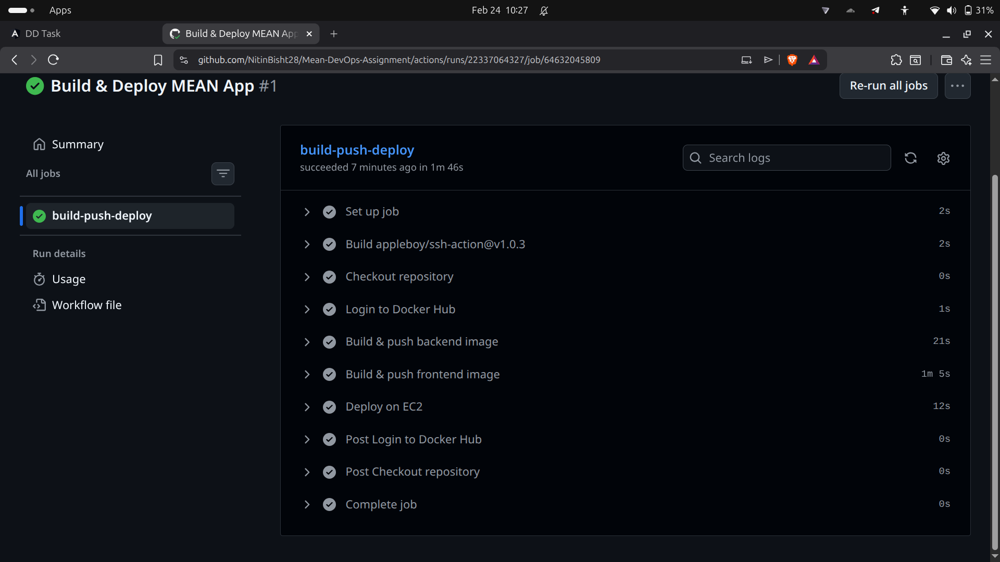

# MEAN Stack CRUD Application – DevOps Assignment

This project demonstrates containerization, CI/CD automation, and cloud deployment of a full-stack **MEAN (MongoDB, Express, Angular, Node.js)** CRUD application.

The application manages a collection of tutorials with full **Create, Read, Update, Delete** functionality and is deployed on **AWS EC2** using **Docker, Docker Compose, Nginx, and GitHub Actions**.

---

## 🧱 Architecture Overview

* **Frontend**: Angular 15
* **Backend**: Node.js + Express (REST API)
* **Database**: MongoDB
* **Reverse Proxy**: Nginx
* **Containerization**: Docker
* **Orchestration**: Docker Compose (v2)
* **CI/CD**: GitHub Actions
* **Cloud**: AWS EC2 (Ubuntu)

Nginx exposes the application on **port 80** and routes requests:

* `/` → Angular frontend
* `/api` → Node.js backend

---

## 📁 Repository Structure

```
.
├── backend/
│   └── Dockerfile
├── frontend/
│   └── Dockerfile
├── nginx/
│   └── nginx.conf
├── docker-compose.yml
├── .github/workflows/
│   └── deploy.yml
├── screenshots/
│   ├── app/
│   ├── cicd/
│   ├── docker/
│   └── infra/
└── README.md
```

---

## ✅ Prerequisites

### Local / Cloud

* Docker
* Docker Compose v2
* GitHub account
* Docker Hub account

### Cloud Deployment

* AWS EC2 (Ubuntu)
* Port **80** allowed in Security Group

---

## 🚀 Local Setup (Optional)

```bash
git clone <REPO_URL>
cd Mean-DevOps-Assignment
docker compose up -d
```

Access:

```
http://localhost
```

---

## ☁️ Cloud Deployment (AWS EC2)

### 1️⃣ Launch EC2

* Ubuntu instance
* Allow inbound **port 80**

### 2️⃣ Install Docker & Docker Compose v2

```bash
sudo apt update
sudo apt install -y docker.io
sudo systemctl enable docker --now

sudo mkdir -p /usr/local/lib/docker/cli-plugins
sudo curl -SL https://github.com/docker/compose/releases/download/v2.25.0/docker-compose-linux-x86_64 \
  -o /usr/local/lib/docker/cli-plugins/docker-compose
sudo chmod +x /usr/local/lib/docker/cli-plugins/docker-compose
```

Verify:

```bash
docker compose version
```

---

### 3️⃣ Clone Repository on EC2

```bash
git clone <REPO_URL>
cd Mean-DevOps-Assignment
```

---

## 🔁 CI/CD Pipeline (GitHub Actions)

A **single unified workflow** is used to avoid partial deployments and container conflicts.

### Pipeline Features

* Triggered on push to `main`
* Ignores README-only changes
* Manual trigger using `workflow_dispatch`
* Builds frontend & backend Docker images
* Pushes images to Docker Hub
* Deploys full stack on EC2 using Docker Compose

### Workflow File

```
.github/workflows/deploy.yml
```

---

## 🔐 GitHub Secrets Used

| Secret Name          | Description             |
| -------------------- | ----------------------- |
| `DOCKERHUB_USERNAME` | Docker Hub username     |
| `DOCKERHUB_TOKEN`    | Docker Hub access token |
| `EC2_HOST`           | EC2 public IP           |
| `EC2_USER`           | `ubuntu`                |
| `EC2_SSH_KEY`        | EC2 private key (.pem)  |

---

## 🐳 Docker Images

The following images are built and pushed automatically:

* `mean-backend:latest`
* `mean-frontend:latest`

### Screenshots




---

## 🌐 Nginx Setup and Infrastructure Details

Nginx is used as a **reverse proxy** to expose the application on port **80**.

### Routing

* `/` → Angular frontend container
* `/api` → Node.js backend container

All services run as Docker containers on an **AWS EC2 Ubuntu instance** using Docker Compose.

### Nginx Configuration



### Running Containers on EC2



### Docker Images on EC2



---

## 🖥️ Application UI & Functionality

The application supports full CRUD operations on tutorials.

### Screenshots





---

## 🔄 CI/CD Execution Proof

### Workflow Success



### Workflow Logs



---

## 🏁 Conclusion

This project demonstrates:

* Full containerization of a MEAN stack app
* Automated CI/CD using GitHub Actions
* Cloud deployment on AWS EC2
* Reverse proxy setup using Nginx
* Clean infrastructure and documentation
